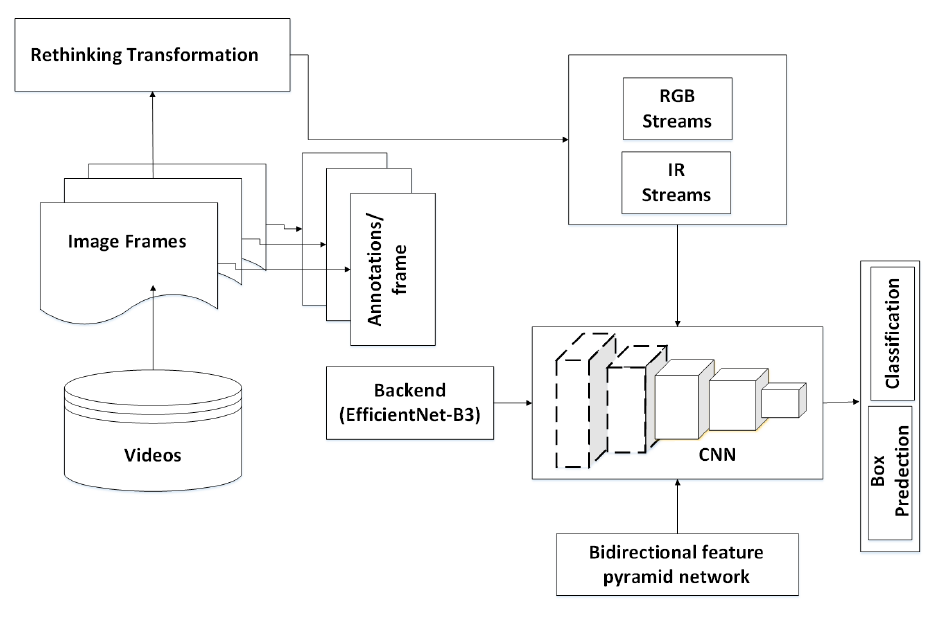

# UAVs-Detection-in-Day-and-Night-Dual-Visions
## Paper: A Hybrid Deep Learning Model for UAVs Detection in Day and Night Dual Visions
Abstract:
Unmanned Aerial Vehicle (UAV) detection for public safety protection is becoming a critical issue in non-fly zones. There are plenty of attempts of the UAV detection using single stream (day or night vision). In this paper, we propose a new hybrid deep learning model to detect the UAV s in day and night visions with a high detection precision and accurate bounding box localization. The proposed hybrid deep learning model is developed with cosine annealing and re-thinking transformation to improve the detection precision and accelerate the training convergence. To validate the hybrid deep learning model, real-world experiments are conducted outdoor in daytime and nighttime, where a surveillance video camera on the ground is set up for capturing the UAV. In addition, the UAV-Catch open database is adopted for offline training of the proposed hybrid model, which enriches training datasets and improves the detection precision. The experimental results show that the proposed hybrid deep learning model achieves 65 % in terms of the mean average detection precision given the input videos in day and night visions.
## Workflow 

## Pre-trained Weights
[Weights for testing](https://drive.google.com/file/d/1pwSm5Nojg9nxtegvFFAmmrgqGTemmH1L/view?usp=sharing)
## Test with pre-trained weights
To test and validate the results please use the "weights in the above link" with the following code file "inference-video.py". Moreover, the videos RGB_test.mp4 and IR_test.mp4 can be used during testing. For "utils" in the "inference-video.py", please visit this link [EfficientDet](https://github.com/xuannianz/EfficientDet/tree/master/utils) download the files and put it in the folder "utils".

## How to Prepare the Custom dataset:
a) Convert videos to frames by using the python script file with name and location:
convert_to_frames_copy.py

b) Convert Json to csv for all video each and individuality by using:
json_to_csv.py or Json_to_csv30t.py or Json_to_csv_test.py

c) Add file name/path_to_frames to csv file for each video by using:
add_file_nameCopy.py or add_file_name_copy.py or add_file_name.py

d) Create a Drone.csv file with data of :
Drone 0 (Drone and 0 should be in row)

e) Each video frames folder should have a folder of that video with csv file Like:
.../data/VideosIRTest/IR1/Label/IR1.csv
The folder Label also have IR.csv file but it is before preprocessed and IR1 after preprocessed. So every video have same files likes IR1 folder with subfolder of Label/ IR* .csv or RGB*.csv file.

f) The folder name with VideosIR and VideosRGBTrain are the training folder for the training data
and .../data
While
VideosIRTest and VideosTest are the testing folder for the testing data and should be located in the: .../data

g) A single file of csv for the training of both RGB+IR should be located:
.../data/IR-RGBTrain.csv and for testing is:
.../data/IR-RGBTest.csv
## Training with EfficientDet
Using the following Script for the training:
python train.py --snapshot imagenet --phi 4 --gpu 0 --random-transform --compute-val-loss --freeze-backbone --batch-size 8 --steps 100 --epochs 600  csv {path to}/data/IR-RGBTrain.csv {path to}/data/Drone.csv --val-annotations-path {path to}/data/IR-RGBTest.csv

Note: Where –phi 4 indicates the EfficientDet-4 and need to be change with the GPU memory and --batch-size 8 also part of the gpu memory.	 
## The Hybrid model code will be shared after cleaning...
In Progress

## Citation
@INPROCEEDINGS{9750351,
  author={Noor, Alam and Li, Kai and Ammar, Adel and Koubaa, Anis and Benjdira, Bilel and Tovar, Eduardo},
  booktitle={2021 IEEE Third International Conference on Cognitive Machine Intelligence (CogMI)}, 
  title={A Hybrid Deep Learning Model for UAVs Detection in Day and Night Dual Visions}, 
  year={2021},
  volume={},
  number={},
  pages={221-231},
  keywords={Deep learning;Night vision;Training;Annealing;Surveillance;Streaming media;Autonomous aerial vehicles;UAV Detection;IR Stream;RGB Stream;Convolutional Neural Networks;Rethinking Transformation;Cosine Annealing},
  doi={10.1109/CogMI52975.2021.00037}}
